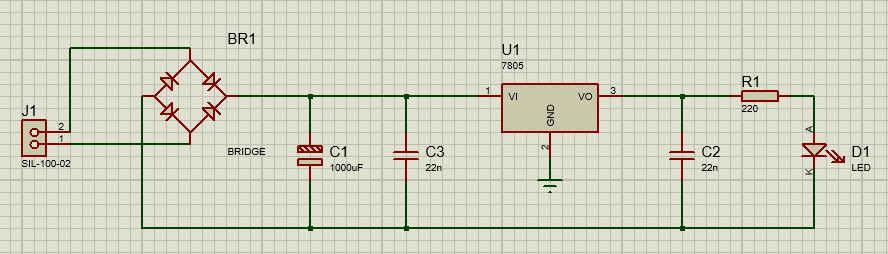

<h1 align="center">
  
</h1>

<table>
  <tr>
    <td width="50%">
      
    </td>
    <td width="50%">
  </a>
    
Trabalho sobre Retificador, solicitado pelo professor Dr. Rafael babosa, para a materia de Sistemas Embarcados do curso de Sistemas de Informações da Universidade MaterDei (UNIMATER)

    </td>
  </tr>
</table>

# O que é um Retificador ?

- Um retificador é um dispositivo eletrônico utilizado para converter corrente alternada (AC) em corrente contínua (DC). Ele realiza essa conversão através de diodos retificadores, que permitem a passagem de corrente em apenas uma direção.

- Existem diferentes tipos de retificadores, os mais comuns são o retificador de meia onda e o retificador de onda completa. O retificador de meia onda utiliza um único diodo para retificar apenas metade do ciclo da corrente alternada, e o retificador de onda completa utiliza dois diodos para retificar ambos os semiciclos da corrente alternada.

# A ponte de diodos 

- Uma ponte de diodos é um circuito eletrônico que utiliza quatro diodos retificadores para converter corrente alternada (AC) em corrente contínua (DC).

- É uma das configurações mais comuns e eficientes para a retificação de corrente alternada, permitindo obter uma retificação de onda completa. Ela é amplamente utilizada em diversas aplicações que requerem a conversão de AC para DC, como fontes de alimentação, carregadores de bateria, inversores de frequência, entre outros.

- A ponte de diodos consiste em quatro diodos retificadores (geralmente diodos de junção PN) conectados em uma configuração específica. Dois diodos são dispostos em série com a polaridade reversa, formando um lado da ponte, e os outros dois diodos são dispostos em série com a polaridade direta, formando o outro lado da ponte. Os pontos de junção dos diodos formam os terminais de saída da ponte, onde é obtida a corrente contínua retificada.

Quando a corrente alternada é aplicada à entrada da ponte de diodos, a configuração em ponte permite que a corrente seja retificada em ambos os semiciclos da onda, resultando em uma corrente contínua de polaridade constante na saída.

- A ponte de diodos oferece diversas vantagens, como uma retificação completa da corrente alternada, maior eficiência em relação a outros tipos de retificadores e facilidade de implementação. Ela se tornou uma solução padrão para retificação de corrente alternada em uma ampla gama de aplicações eletrônicas.

# Schematic do Retificador no Proteus

<a href="https://github.com/DanielScabeni">

# Componentes 

- O conector macho de duas entradas (J1) é a porta de entrada para a energia elétrica no circuito. Ele permite a conexão direta do transformador ao circuito, fornecendo a energia necessária para o funcionamento dos componentes.

- BR1 (BIRDGR) Na ponte de diodos, os quatro diodos são arranjados em uma estrutura que forma uma ponte, permitindo que a corrente flua em uma direção específica.

- Capacitores C1, C2 e C3, são utilizados para ajudar a manter uma corrente mais constante durante a inversão na ponte de diodos. Eles desempenham um papel importante ao armazenar e liberar cargas elétricas, ajudando a suavizar a tensão e fornecer uma corrente mais estável.

- Regulador de tensão (UI), sua função basicamente é manter a tensão constante, protegendo os dispositivos eletrônicos contra variações de tensão que possam afetar seu desempenho ou causar danos.

- Resistor (R1): é um componente eletrônico que limita o fluxo de corrente em um circuito. Ele desempenha diversas funções, como controlar a intensidade da corrente, ajustar a tensão, dividir a tensão e polarizar transistores.